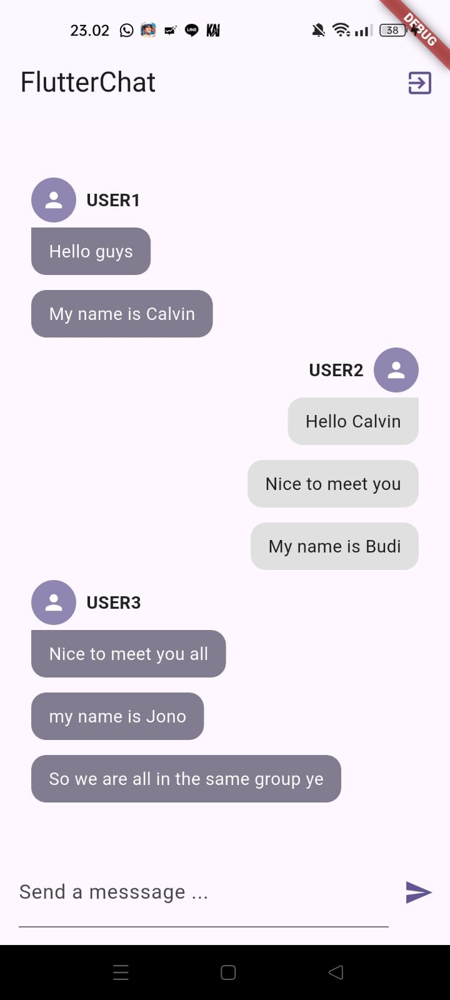

# 📱 Flutter Group Chat App

A simple **Group Chat App** built using **Flutter** and powered by **Firebase**. This app allows users to register and log in using their email and password, then join a shared group chat where all authenticated users can send and receive messages in real-time.

---

### 🚀 Features

- 🔐 **User Authentication**
  - Login with email and password
  - Sign up with email, password, and username
- 💬 **Group Chat**
  - Messages are shared in real-time across all users
  - Any user can send and read messages after logging in
- ☁️ **Firebase Integration**
  - Firebase Authentication for user management
  - Firebase Firestore for storing chat messages

---

### 🛠️ Tech Stack

- **Flutter** - Cross-platform UI toolkit
- **Firebase Authentication** - Handles login and registration
- **Firebase Firestore**  - Stores chat messages
- **Dart** - Programming language used in Flutter

---

### 📷 Screenshots 

  
  
  

  <strong>Login Page</strong>&nbsp;&nbsp;&nbsp;&nbsp;&nbsp;
  <strong>Sign Up Page</strong>&nbsp;&nbsp;&nbsp;&nbsp;&nbsp;
  <strong>Group Chat Page</strong>

